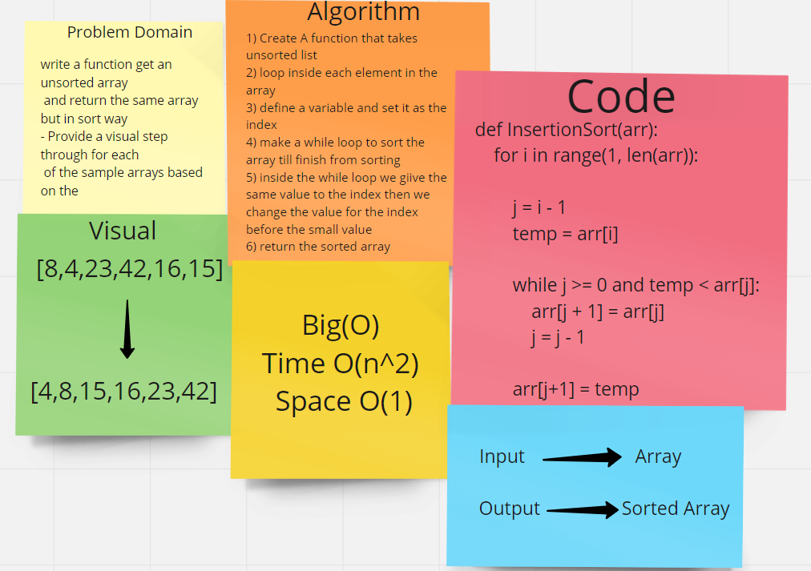

## Code Challenge: Class 26 | Insertion Sort

### Challenge
- write a function get an unsorted array and return the same array but in sort way
- Provide a visual step through for each of the sample arrays based on the provided pseudo code

## Algorithm:
1) Create A function that takes unsorted list
2) loop inside each element in the array 
3) define a variable and set it as the index
4) make a while loop to sort the array till finish from sorting
5) inside the while loop we giive the same value to the index then we change the value for the index before the small value
6) return the sorted array

### Big(O)
- Time: O(n^2)
- Space: O(1)

## white board
