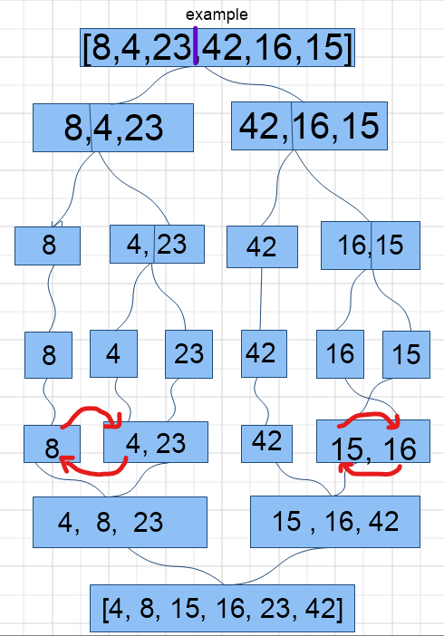

# Code Challenge: Class 27 | Merge Sort

## Challenge Description
- Provide a visual step through for each of the sample arrays based on the provided pseudo code
- Convert the pseudo-code into working code in your language
Present a complete set of working tests

## Solution

```
def Mergesort(arr):
    n = len(arr)

    if n > 1:
        mid = n//2
        left = arr[0:mid]
        right = arr[mid:n]
        
        Mergesort(left) # sort the left side
        
        Mergesort(right) # sort the right side
        
        Merge(left, right, arr) # merge the sorted left and right sides together

def Merge(left, right, arr):
    i = 0
    j = 0
    k = 0

    while i < len(left) and j < len(right):
        
        if left[i] <= right[j]:
            arr[k] = left[i]
            i += 1
        else:
            arr[k] = right[j]
            j +=  1
            
        k += 1

    while i < len(left):
        arr[k] = left[i]
        i += 1
        k += 1
    
    while j < len(right):
        arr[k] = right[j]
        j += 1
        k += 1
```
- we split the array into 2 parts from the middle after getting length the split every part again and again until single elements left using recursion save it as left and right of every part then assign values to the parent using it's pointer

### white board

