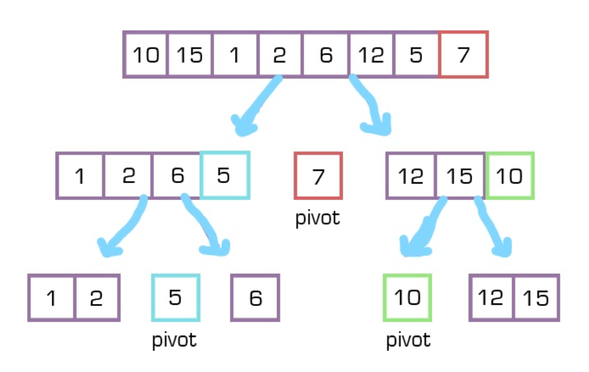

# Code Challenge: Class 28 | Quick Sort

## Challenge Description
- Provide a visual step through for each of the sample arrays based on the provided pseudo code
- Convert the pseudo-code into working code in your language
- Present a complete set of working tests

## Solution

```
def QuickSort(arr, left, right):
    if left < right: 
        position = Partition(arr, left, right)
        QuickSort(arr, left, position - 1)
        QuickSort(arr, position + 1, right)

def Partition(arr, left, right):
    pivot = arr[right]
    low = left - 1
    for i in range (left , right):
        if arr[i] <= pivot:
            low += 1
            Swap(arr, i, low)

    Swap(arr, right, low + 1)
    # return the pivot index point
    return low + 1

def Swap(arr, i, low):
    temp = arr[i]
    arr[i] = arr[low]
    arr[low] = temp
```
## Algorithm
- we pick the highest index value as a pivot then Partition the array by setting the position of the pivot value and create a variable to track the largest index of numbers lower than the defined pivot
- all numbers smaller than the pivot are on the left, larger on the right. 
- while value at left is less than pivot move right
- while value at right is greater than pivot move left
- return the pivot index point

# Big O
Time: O(n^2)
space O(1)

### white board

