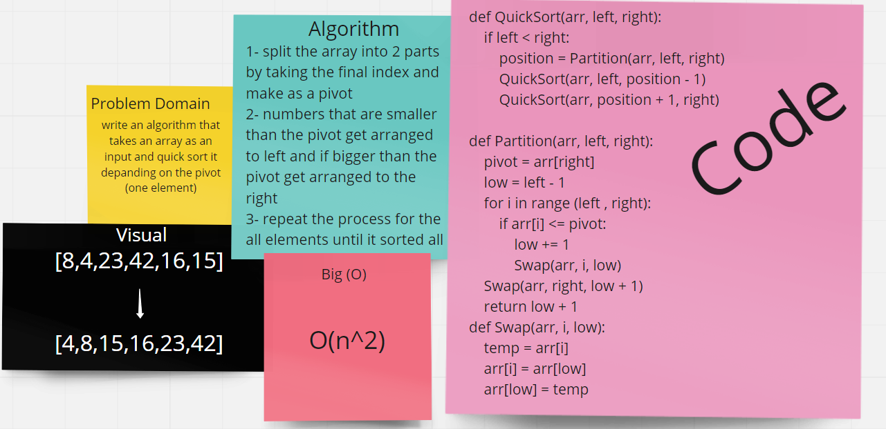

## Algorithm
- we pick the highest index value as a pivot then Partition the array by setting the position of the pivot value and create a variable to track the largest index of numbers lower than the defined pivot
- all numbers smaller than the pivot are on the left, larger on the right. 
- while value at left is less than pivot move right
- while value at right is greater than pivot move left
- return the pivot index point

## Big O
Time: O(n^2)
space O(1)

## white board
