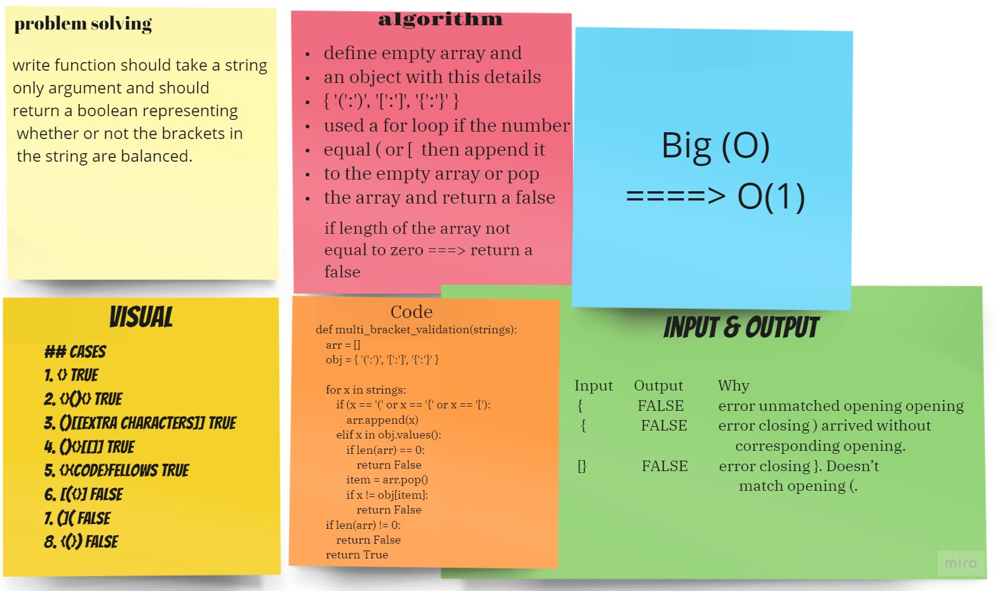

## Code Challenge: Class 13 [Multi-Brackets Validation]
#### Challenge
- The function should take a string only argument and should return a boolean representing whether or not the brackets in the string are balanced. 

## Approach & Efficiency

Big O => ====> O(1)

1) I used empty array and an object with this details { '(':')', '[':']', '{':'}' }
2) I used a for loop if the number equal ( or [  then append it to the empty array or pop the array and return a false
3) if length of the array not equal to zero ===> return a false

## Cases
1. {} TRUE 
2. {}(){} TRUE 
3. ()[[Extra Characters]] TRUE 
4. (){}[[]] TRUE 
5. {}{Code}Fellows TRUE 
6. [({}] FALSE 
7. (]( FALSE 
8. {(}) FALSE

