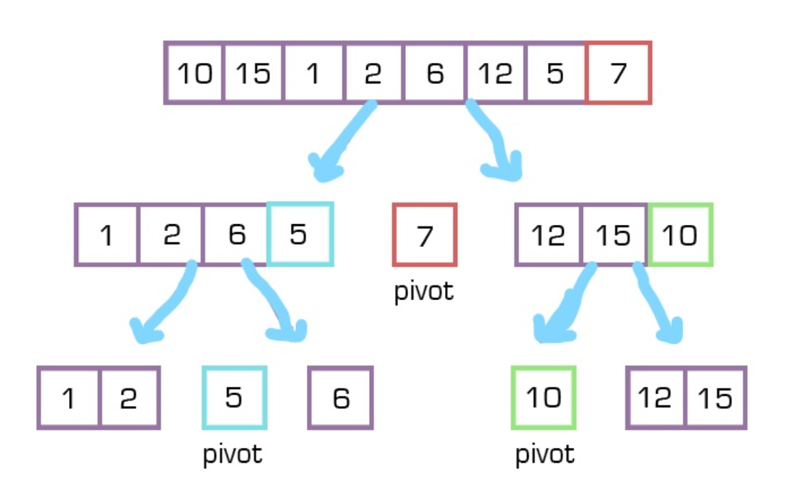

# Code Challenge: Class 28 | Quick Sort

## Challenge Description
- Provide a visual step through for each of the sample arrays based on the provided pseudo code
- - Convert the pseudo-code into working code in your language
Present a complete set of working tests

## Solution

```

```
- 

### white board

