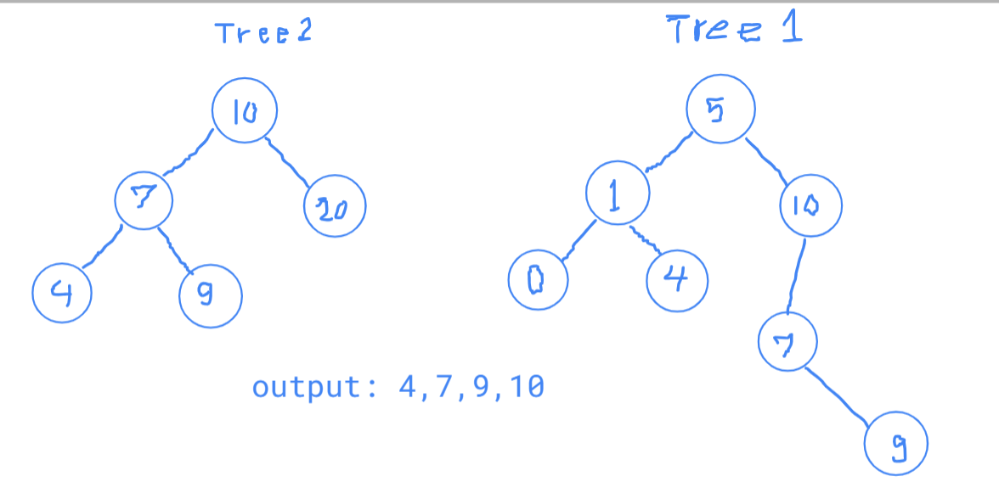

## Code Challenge: Class 32 | tree-intersection

### problem domain
- Write a function called tree_intersection that takes two binary tree parameters.
Without utilizing any of the built-in library methods available to your language, return a set of values found in both trees.

input >>> 2 Trees
Output >>> Set of common values between the 2 trees

### Algorithm
1. Travers both tree with preorder( this will result in 2 arays)
2. convert the second array to set
3. Iterate over the first array and check if the element exists in the set
    - if exists add to the output set


### pseudoCode:
```
- Define a function treesInsersection(T1,T2)
// input: 2 Trees
// Output: Set of common values between the 2 trees

Declare array1 <- T1.preorder()
Declare array2 <- T2.preorder()
Delare set2 <- Set of array2
Decalre outputset <- empty set
for element in array1
     if element is in set2 then, 
        add it to the outputSet
return outputset
```

O(n)
O(n)


Big(O)  
time >>>> O(n)
space >>>> O(n)


## visual
'Once upon a time, there was a brave princess who'

>>>>

'a'

### white board
