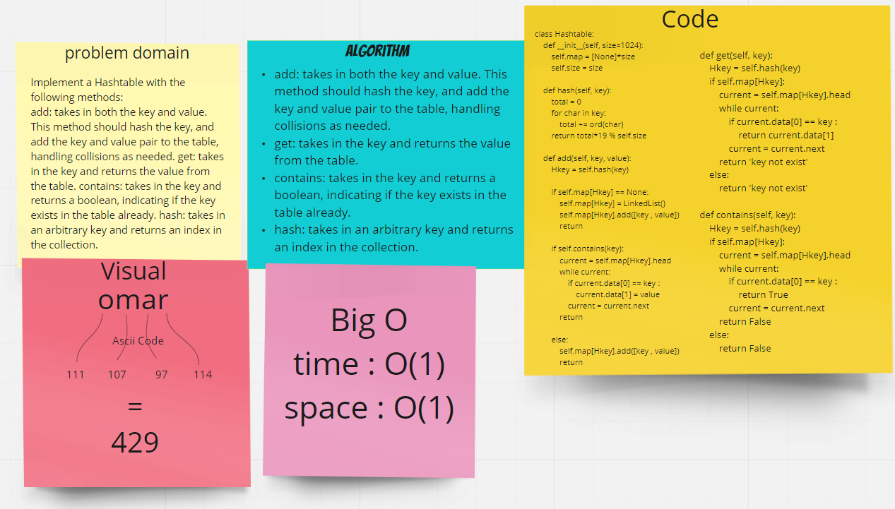

## Code Challenge: Class 30 | Hash Table Implementation

## challenge
- Implement a Hashtable with the following methods:
1) add: takes in both the key and value. This method should hash the key, and add the key and value pair to the table, handling collisions as needed.
2) get: takes in the key and returns the value from the table.
3) contains: takes in the key and returns a boolean, indicating if the key exists in the table already.
4) hash: takes in an arbitrary key and returns an index in the collection.

## Approach & Efficiency
- An array was the chosen data structure to use for the HashTable and a linked list was the chosen data structure for to use at each index of the Hash Table to handle collisions, adding key/value pairs and getting values from the Hash Table is essentially O(1) for time for both posting and getting. Big O is always looking for the worst case scenario. The worst case would be the length of the linked list at any given index.

### API
- hash(key) : it hashing any inputed key with hash method and returns it hashed in range the hash_table size
- add(key, value) : it used to add your kay and value to the hash_table
- get(key) : it used to get you the value of your inputed key if it exist in the hash table
- contains(key) : your not sure if your key is exist on hash table? this fuction will check and return boolean

## Big O
 time O(1)
space O(1)

### white board

