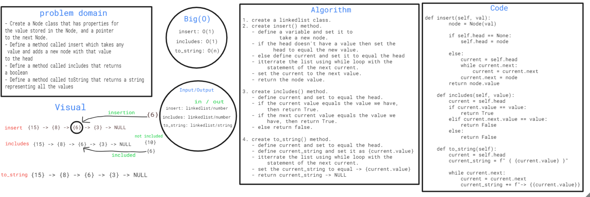

## Challenge05 linked-list

### Challenge
- Create a Node class that has properties for 
the value stored in the Node, and a pointer 
to the next Node.

### Approach & Efficiency
- Define a method called insert which takes any
 value and adds a new node with that value 
to the head
- Define a method called includes that returns 
a boolean
- Define a method called toString that returns a string
representing all the values.

### Big(O)
- insert: O(1)
- includes: O(1)
- to_string: O(n)

### White board

- Can successfully add a node to the end of the linked list
- Can successfully add multiple nodes to the end of a linked list
- Can successfully insert a node before a node located i the middle of a linked list
- Can successfully insert a node before the first node of a linked list
- Can successfully insert after a node in the middle of the linked list
- Can successfully insert a node after the last node of the linked list