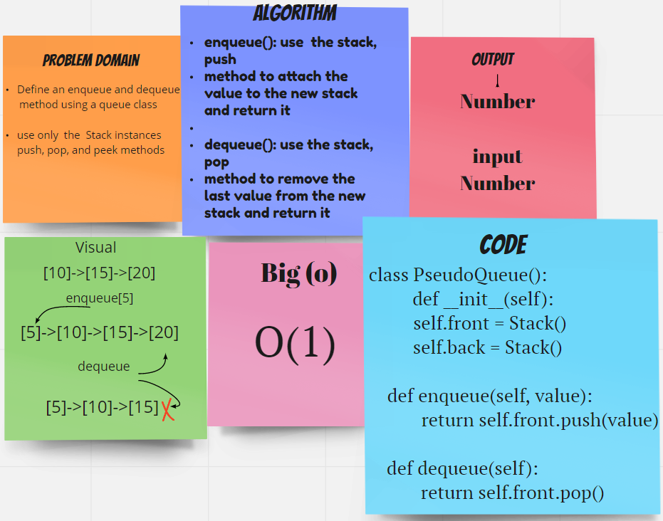

## Class 11: Stack with Queue

### Challenge
- Define an enqueue and dequeue method using a queue class
- use only  the  Stack instances  push, pop, and peek methods

## Approach & Efficiency
- enqueue(): use  the stack, push
method to attach the value to the new stack and return it

- dequeue(): use the stack, pop
method to remove the last value from the new stack and return it

### White board

