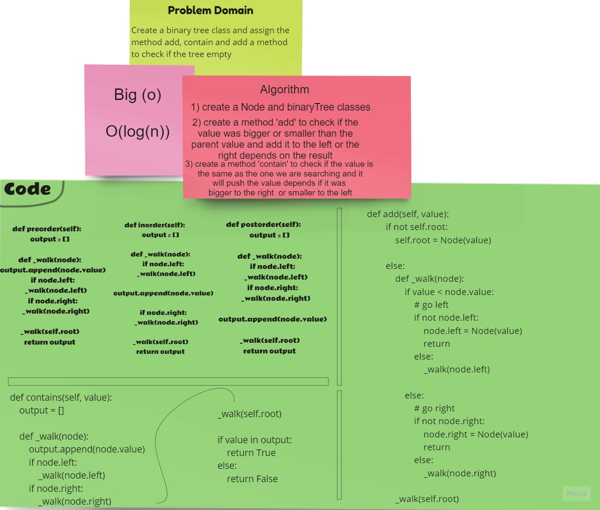
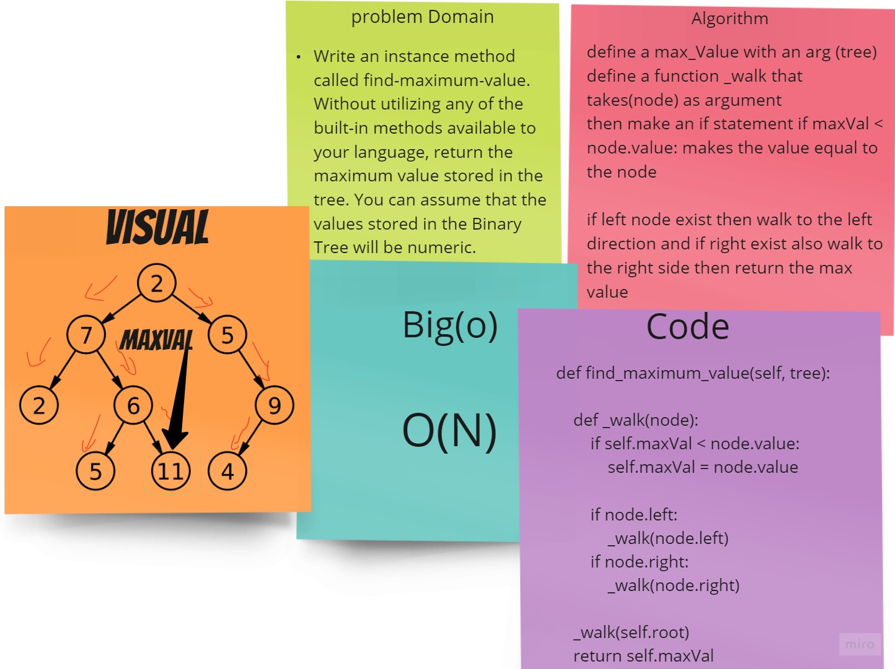

## Code Challenge: Class 15 | Binary Tree and BST Implementation
### Challenge
- Create a Node class that has properties for the value stored in the node, the left child node, and the right child node.
Create a BinaryTree class
- Define a method for each of the depth first traversals called preOrder, inOrder, and postOrder which returns an array of the values, ordered appropriately.

## White Board

# ==========================================

## Code Challenge: Class 16 | find-maximum-binary-tree
### Challenge
- Write an instance method called find-maximum-value. Without utilizing any of the built-in methods available to your language, return the maximum value stored in the tree. You can assume that the values stored in the Binary Tree will be numeric.

## White Board

# ============================================

## Code Challenge: Class 17 | breadth first

### Challenge Summary
Write a breadth first traversal method which takes a Binary Tree as its unique input. Without utilizing any of the built-in methods available to your language, traverse the input tree using a Breadth-first approach.

### Challenge Description
- return a list of the values in the tree in the order they were encountered.

### Approach & Efficiency
Big(o) ===> O(N)

### Solution

# ============================================
## Code Challenge: Class 18 | FizzBuzzTree 

### Challenge Summary
Write a function called FizzBuzzTree which takes a k-ary tree as an argument.
Without utilizing any of the built-in methods available to your language, determine whether or not the value of each node is divisible by 3, 5 or both. 

### Challenge Description
- Create a new tree with the same structure as the original, but the values modified as follows:
- If the value is divisible by 3, replace the value with “Fizz”
- If the value is divisible by 5, replace the value with “Buzz”
- If the value is divisible by 3 and 5, replace the value with “FizzBuzz”
- If the value is not divisible by 3 or 5, simply turn the number into a String.

### Approach & Efficiency
Big(o) ===> O(N)

### Solution

# ============================================